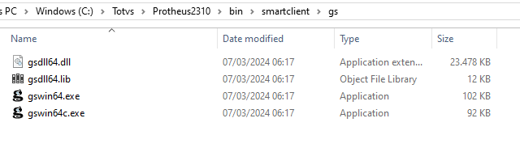

# Mesclando documentos PDF com Protheus e Ghostscript


# Ghostscript 

Ghostscript é um intérprete para a linguagem PostScript®  e arquivos PDF . Ele está disponível sob a licença GNU GPL Affero ou  licenciado para uso comercial pela Artifex Software, Inc. Ele está em desenvolvimento ativo há mais de 30 anos e foi portado para vários sistemas diferentes durante esse período. Ghostscript consiste em uma camada de interpretação PostScript e uma biblioteca gráfica.

Download Ghostscript https://www.ghostscript.com/releases/gsdnld.html

# Como começar
Para realizar a mesclagem de documentos usando Protheus e Ghostscript, precisaremos baixar as DLL's do Ghostscript

Neste exemplo, precisarei apenas dos seguintes arquivos do Ghostscript:
gsdll64.dll
gsdll64.lib
gswin64.exe
gswin64c.exe

Irei salvá-los na pasta onde está instalado o smartclient.exe, ficando assim: C:\Totvs\Protheus2310\bin\smartclient\gs\



# Sintaxe
```python
gswin64.exe -dNOPAUSE -sDEVICE=pdfwrite -sOUTPUTFILE=c:\arquivomesclado.pdf -dBATCH arquivo1.pdf arquivo2.pdf

-dNOPAUSE = Desativa o prompt e pausa no final de cada página.
-sDEVICE = Informe o dispositivo de saida (pdfwrite para gerar um arquivo PDF)
-dBATCH = arquivos que serão mesclados
```
